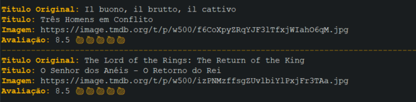
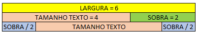

# Alura: Imersão Java

<p align="center">

</p>

Projeto muito interessante realizado na imersão Java da **ALURA**. Ele tras um grande aprendizado 
para quem está começando e um grande desafio àqueles que estão no meio do caminho. Eu, 
estou entre esses dois, e, como parte da minha contribuição, irei descrever, com o pouco 
que sei, como eu passei pelos desafios. 

**IMPORTATE!!**
As descrições de como resolvi os desafios podem estar diferentes dos código que estão 
nos fontes do projeto, pois com o caminhar das aulas o código será refatorado. 

Espero poder contribuir com aqueles que estão nessa jornada assim como eu.

**Onde me encontrar**

[](https://www.linkedin.com/in/rodrigo-goncalves-650545146/)

<details>
<summary><h1> Aula 01 </h1></summary>

Tudo começa com a consulta em uma API de filmes, a selecionada foi **imdb**, e como ela 
esperado ela cai, com isso utilizamos a **themoviedb**, e alguns colegas disponibilizaram 
outras. 

Eu tive que utilizar um arquivo estático; estou acompanhando a imersão na empresa e 
meu **eclipse** não quer me ajudar, e não quero perder tempo arrumando o problema dele.

Dito isso, vamos ao que interessa. A Chamada via API pode ser vista no arquivo **AppStickerFromApi**.
Realizar a chama é relativamente simples:

Iniciamos criando a *URI* que iremos utilizar

```java
String url = "https://api.mocki.io/v2/549a5d8b/Top250Movies";
URI uriClient = URI.create(url);
```

**URIS SUJERIDAS**
* https://api.mocki.io/v2/549a5d8b/Top250Movies - Criada por alguns de nossos amigos, 
não me recordo quem.
* https://imdb-api.com/en/API/Top250Movies/ - imdb api top 250 movies, é necessário 
criar uma conta e gerar uma *api key*.
* https://api.themoviedb.org/3/tv/top_rated - themoviedb top rated, é necessário criar 
uma conta e gerar uma *api key*.

Agora criamos um *client* que irá chamar essa *URI*
```java
HttpClient client = HttpClient.newHttpClient();
```

Preparamos a nossa chamada
```java
HttpRequest request = HttpRequest.newBuilder(uriClient).GET().build();
```

E a realizamos com e pegamos somente o "corpo" do retorno:
```java
HttpResponse<String> response = client.send(request, BodyHandlers.ofString());
String responseBody = response.body();
```

O tratamento do retorno foi realizado em um desafio, irei descrevê-lo lá.

## Resumo
1. Criar a URI do serviço que iremos utilizar.
2. Criar um cliente com `HttpClient`.
3. Criar uma requisição com `HttpRequest`.
4. Fazer a requisição com `client.send(request, BodyHandlers.ofString())`.
5. Pegar o *body* do retorno.
6. Tratar o retorno.

<details>
<summary><h2> Desafios aula 01 </h2></summary>

<details>
<summary><h3> Desafio 01 </h3></summary>

<p align="center">

</p>

Consumir o endpoint de filmes mais populares da API do IMDB. Procure também, na 
documentação da API do IMDB, o endpoint que retorna as melhores séries e o que 
retorna as séries mais populares.

</details>

<details>
<summary><h3> Desafio 02 </h3></summary>

<p align="center">

</p>

Usar sua criatividade para deixar a saída dos dados mais bonitinha: usar emojis 
com código UTF-8, mostrar a nota do filme como estrelinhas, decorar o terminal 
com cores, negrito e itálico usando códigos ANSI, e mais!

**SOLUÇÃO**

Tive alguns problemas com essa demanda, meu terminal não reconhecia os caracteres que 
criam as cores, tive que baixar um plugin para resolver esse problema.

[ANSI Escapes](https://github.com/mihnita/ansi-econsole).

Resolvendo isso, bastou entrar na documentação sujerida pela **Alura**

[ALURA: Decorando terminal cores emojis](https://www.alura.com.br/artigos/decorando-terminal-cores-emojis).

e "codar". 

Na classe *AppStickerFromFile* criei minhas variáveis que guardarão as cores que utilizarei.
```java
final static String NEGRITO = "\u001B[1m";
final static String RESET = "\u001B[0m";
final static String COR_TITULO = "\u001B[38;2;254;181;0m";
final static String FUNDO_TITULO = "\u001B[48;2;234;214;164m";
final static String COR_LINHA = "\u001B[38;2;178;129;7m";
final static String COR_EMOJI = "\u001B[38;2;164;123;22m";
```

Agora é só brincar com os *prints*
```java
System.out.print(COR_LINHA);
System.out.println("-".repeat(100));
System.out.print(RESET);

System.out.print(NEGRITO + COR_TITULO);
System.out.print("Título Original:");
System.out.print(RESET + " ");
System.out.print(jsFilme.get("original_title"));

(...)
```



</details>

<details>
<summary><h3> Desafio 03 </h3></summary>


<p align="center">

</p>

Colocar a chave da API do IMDB em algum lugar fora do código como um arquivo 
de configuração (p. ex, um arquivo .properties) ou uma variável de ambiente.

**SOLUÇÃO**

Como eu já resolvi isso com alguns projetos do trabalho, foi relativamente fácil.
Criei a pasta **config** com o arquivo **config.properties** dentro. Neste eu coloquei 
as minhas chaves

```bach
imdb_key = minha-chave-linda
themoviedb_key = minha-chave-linda-dois
```

A classe a baixo abre o arquivo, itera sobre ele pegando todas as entradas e retorna 
um `Map` com as chaves que coloquei no arquivo.

```java
private Map<String, String> getParametrosIntegracao(String nomeArquivoParam) throws Exception {
		if (!nomeArquivoParam.endsWith(".properties")) {
			nomeArquivoParam += ".properties";
		}

		FileInputStream arquivo = new FileInputStream(nomeArquivoParam);
		Properties properties = new Properties();
		properties.load(arquivo);

		Set<Object> keySet = properties.keySet();
		Iterator<Object> iterator = keySet.iterator();
		Map<String, String> parametroMap = new HashMap<String, String>();

		while (iterator.hasNext()) {
			String key = (String) iterator.next();
			parametroMap.put(key, properties.getProperty(key));
		}
		return parametroMap;
	}
```

Existe uma outra classe nesse arquivo que busca por uma *api key* especifica

```java
public void setApiKey(String apiKey) {
		
		File classPath = new File(".");
		String configPath = classPath.getAbsolutePath() + "/config/";
						
		Map<String, String> properties;
		try {
			properties = getParametrosIntegracao(configPath + "config");
			this.apiKey = properties.get(apiKey);
		} catch (Exception e) {
			e.printStackTrace();
		}
		
	}
	
	public String getApiKey() {
		return apiKey;
	}
```

Agora fica simples pegar uma *api key* que está dentro do meu arquivo que configuração, 
basta criar uma instância da classe **UtilProperties**, chamar **setApiKey** passando no 
nome da chave, e buscar o resultado com **getApiKey**

```java
UtilProperties properties = new UtilProperties();
properties.setApiKey("themoviedb_key");
String url = "https://imdb-api.com/en/API/Top250Movies/" + properties.getApiKey();
```

</details>

<details>
<summary><h3> Desafio 04 </h3></summary>

<p align="center">

</p>

Mudar o JsonParser para usar uma biblioteca de parsing de JSON como Jackson ou GSON. 
 
**SOLUÇÃO**

Usei outra biblioteca a *simple parser*

[Exemplo de utilização da biblioteca](https://www.geeksforgeeks.org/parse-json-java/)

Para resolver esse problema criei uma classe **UtilJson** que realizara os tratamentos necessário. 
Lembre-se: **Estou utilizando um arquivo .json pois não estou conseguindo chamar apis 
no meu serviço**

Dito isso. Na classe existe um método que é responsavel por abrir o arquivo .json e 
retornar um **Object**, dessa forma ficará mais fácil realizar os tratamentos posteriores.

```java
public Object getArquivoJson(String arquivo) {	
		Object obj = new Object();
		String pathJsonFile = this.absPath + File.separator + "base-dados" + File.separator + arquivo + ".json";
		
		try {
			obj = new JSONParser().parse(new FileReader(pathJsonFile));			
			
		} catch (FileNotFoundException e) {			
			throw new RuntimeException(e);
		} catch (IOException e) {			
			throw new RuntimeException(e);
		} catch (ParseException e) {			
			throw new RuntimeException(e);
		}	
		return obj;
	}
```

O tratamento é feito dependendo da API que estamos chamando, pois cada uma retonar um 
Json. 

Por exemplo temos o extrator para as chamadas no **The Movie DB**. Veja que nesse caso, 
primeiro eu transformo o de **Object** para **JSONObject**, pego a **tag results** e 
depois transformo em **JSONArray**. Isso tudo para poder conseguir fazer um *forEach*.

```java
	public List<Conteudo> extraiConteudosTheMovieDb(Object json){
		
		JSONArray jsonArray = (JSONArray) ((JSONObject) json).get("results");
		
		List<Conteudo> conteudos = new ArrayList<>();

		jsonArray.forEach((elemento) -> {
			JSONObject conteudo = (JSONObject) elemento;			
			conteudos.add(
					new Conteudo(conteudo.get("title").toString(), 
							     "https://image.tmdb.org/t/p/w500" + conteudo.get("poster_path"), 
							     conteudo.get("vote_average").toString())								 
				);
			
		});
		
		return conteudos;
		
	}
```

</details>

<details>
<summary><h3> Desafio 05 </h3></summary>

<p align="center">

</p>


Desafio supremo: criar alguma maneira para você dar uma avaliação ao filme, puxando de 
algum arquivo de configuração OU pedindo a avaliação para o usuário digitar no terminal. 

**SOLUÇÃO**

Fiz algo bem simples, criei a classe **AppStickerSalvaVoto**, ela pedirá algumas informação 
ao usuário e chamará o método **salvarVoto** da classe **UtilJson**.

O funcionamento desse método é relativamente simmples. Cria um **JSONObject** insere 
as informações que foram passadas como paramêtro, cria um **PrintWriter**, ele será 
o responsável por salvar as informações em um arquivo.

Como disse é algo bem simples, recebe o voto e salva em um arquivo.

```java
public void salvarVoto(String Usuario, String title, String rating) {
		JSONObject jo = new JSONObject();
		String classPath = UtilJson.class.getClassLoader().getResource("").getPath();
		String votoPath = classPath + "../base-dados/" ;
		
		jo.put("title", title);
		jo.put("usuario", Usuario);
		jo.put("rating", rating);
					
		try {
			PrintWriter pw = new PrintWriter(votoPath + "Filmes.json");
			pw.write(jo.toJSONString());         
	        pw.flush();
	        pw.close();
		} catch (FileNotFoundException e) {	
			throw new RuntimeException(e);
		}
	}
```

</details>
   
</details>
</details>

<details>
<summary><h1> Aula 02 </h1></summary>

<details>
<summary><h2> Desafios aula 02 </h2></summary>

<details>
<summary><h3> Desafio 01 </h3></summary>

<p align="center">

</p>

Ler a documentação da classe abstrata InputStream.

**SOLUÇÃO**

Lido.

</details>
<details>
<summary><h3> Desafio 02 </h3></summary>

<p align="center">

</p>

Centralizar o texto na figurinha.

**SOLUÇÃO**

A conta é relativamente simples. Pegar a largura total da imagem, subtrair a largura 
do texto, isso nos dará o espaço que sobra, basta dividir esse valor por dois. E pegar 
essa possição como a inicial para o texto.

```java
int xInicial = (int) ((largura - textLayout.getAdvance()) / 2);
```

Caso tenha ficado meio confuso a conta, tente entender esse imagem.



</details>
<details>
<summary><h3> Desafio 02 </h3></summary>

<p align="center">

</p>

Fazer um pacote no Whatsapp e/ou Telegram com as suas próprias figurinhas!

</details>
<details>
<summary><h3> Desafio 04 </h3></summary>

<p align="center">

</p>

Criar diretório de saída das imagens, se ainda não existir.

**SOLUÇÃO**

No meu caso eu criei o diretório a mão, mas a solução é fácil. A biblioteca **File** 
ajuda e muito nessa hora. Com ela podemos verificar se um diretório existe, se não basta 
criá-lo.

```java
if (!new File(caminhoPasta).exists()) {
	new File(caminhoPasta).mkdirs();
}
```

</details>
<details>
<summary><h3> Desafio 05 </h3></summary>

<p align="center">

</p>

Colocar outra fonte como a Comic Sans ou a Impact, a fonte usada em memes.

</details>
<details>
<summary><h3> Desafio 06 </h3></summary>

<p align="center">

</p>

Colocar uma imagem de você que está fazendo esse curso sorrindo, fazendo joinha!

</details>
<details>
<summary><h3> Desafio 07 </h3></summary>

<p align="center">

</p>

Colocar contorno (outline) no texto da imagem.

**SOLUÇÃO**

Nesse o Alexandre da **Alura** me ajudou e muito. Confesso que não entendo muito o que 
está acontecendo ai; pelo que li, quem faz esse **outline** é o método **setStroke**, 
ele deve receber um objeto do tipo **Strock**, por isso criamos um **BasicStroke**, 

Para escrever a frase precisamos usar o método **draw**, que recebe um objeto do tipo 
**Shape** que foi criado em `Shape outline = textLayout.getOutline(null);`

```java
FontRenderContext fontRenderContext = graphics.getFontRenderContext();
			Font font = new Font(Font.SANS_SERIF, Font.BOLD, 60);
			
			TextLayout textLayout = new TextLayout(textoImagem, font, fontRenderContext);

			Shape outline = textLayout.getOutline(null);
			AffineTransform transform = graphics.getTransform();
			
			int xInicial = (int) ((largura - textLayout.getAdvance()) / 2);
			transform.translate(xInicial, novaAltura - 150);
			graphics.setTransform(transform);

			BasicStroke outlineStroke = new BasicStroke(largura * 0.004166f);
			graphics.setStroke(outlineStroke);

			graphics.setColor(Color.DARK_GRAY);
			graphics.draw(outline);
			graphics.setClip(outline);
```

</details>
<details>
<summary><h3> Desafio 08 </h3></summary>

<p align="center">

</p>

Tratar as imagens retornadas pela API do IMDB para pegar uma imagem maior ao invés 
dos thumbnails. Opções: pegar a URL da imagem e remover o trecho mostrado durante a aula. 
ou consumir o endpoint de posters da API do IMDB (mais trabalhoso), tratando o JSON retornado. 

</details>
<details>
<summary><h3> Desafio 09 </h3></summary>

<p align="center">

</p>

Fazer com que o texto da figurinha seja personalizado de acordo com as classificações do IMDB.

**SOLUÇÃO**

Fácil, ao menos uma é. Na minha classe **GeradorDeFigurinhas** criei o método **textoImagem** 
que recebe o **voto**, utilizando o operador ternário eu consigo verificar o voto e 
dar uma mensagem personalizada.

**Vale lembrar que estou utilizando um arquio estático como fonte dos dados, e nele só 
possiu os voltos 8.5, 8.6 e 8.7, por isso que a solução ficou assim**

```java
public String textoImagem(String voto) {
		
		return voto.equals("8.5") ? "The Third One" : 
               voto.equals("8.6") ? "The Second One" : 
	           voto.equals("8.7") ? "The Big One" :
		                            "No One";
	}
```

</details>
<details>
<summary><h3> Desafio 10 </h3></summary>

<p align="center">

</p>

Desafio supremo usar alguma biblioteca de manipulação de imagens como OpenCV pra 
extrair imagem principal e contorná-la.

</details>

</details>
</details>

<details>
<summary><h1> Aula 03 </h1></summary>

Nessa aula consumimos a API da nasa, nela conseguimos trazer outras imagens para o nosso 
projeto.

Também refatoramos o nosso código. Criamos a classe **ClienteHttp**, esse será a responsável 
por fazer as chamadas nas APIs. 

```java
public String BuscaDados(String url) {				
		
		try {		
			URI uriClient = URI.create(url);		
			HttpClient client = HttpClient.newHttpClient();			
			HttpRequest request = HttpRequest.newBuilder(uriClient).GET().build();	
			
			HttpResponse<String> response;
			response = client.send(request, BodyHandlers.ofString());
			
			return response.body();
		} catch (IOException | InterruptedException e) {	
			throw new TrataExecoes("Algo De Errado Não Está Certo" , e);									
		} 		
	}
}
```

Na parte do extrator de contéudo eu fiz um pouco diferente. Criei uma unica classe com 
todos os métodos de extração dentro. A classe é **Extratores**, e como exemplo de método 
temos os:

Essa primeira classe trata a extração de informação quando é passado uma **String**. 
E a que foi desenvolvida em aula, eu adaptei um pouco, veja que **conteudo** recebe 
um parametro a mais.

```java
public List<Conteudo> extraiConteudosNasa(String json){
		
		JsonParser parser = new JsonParser();
		List<Map<String, String>> listaDeAtributos = parser.parse(json);
		
		List<Conteudo> conteudos = new ArrayList<>();
		
		for(Map<String, String> atributos : listaDeAtributos) {
			String titulo = atributos.get("title");
			String urlImage = atributos.get("url");
			
			Conteudo conteudo = new Conteudo(titulo, urlImage, "0.0");
			
			conteudos.add(conteudo);
		}
		
		return conteudos;
		
	}
```

Para o meu caso, criei uma classe com o mesmo nome, porem recebendo um **object**

```java
public List<Conteudo> extraiConteudosNasa(Object json){
		
		JSONArray jsonArray = (JSONArray) json;	
		
		List<Conteudo> conteudos = new ArrayList<>();
		
		jsonArray.forEach((elemento) -> {
			JSONObject conteudo = (JSONObject) elemento;
			conteudos.add(
					new Conteudo(conteudo.get("title").toString(), 
							     conteudo.get("url").toString(), 
							     "9.0")
					);
			
		});
		
		return conteudos;
		
	}
```

Por fim, mas não menos importante. Criamos uma classe **Conteudo** representando o objeto 
em que estamos trabalhando

**NOTA: ** Veja que não temos uma classe mas, sim **record**. Isso porque documentei 
após a execução dos desafios. 

```java
public record Conteudo(
		
		String titulo,
		String urlImagem,
		String voto
	) {}
```

<details>
<summary><h2> Desafios aula 03 </h2></summary>

<details>
<summary><h3> Desafio 01 </h3></summary>

<p align="center">

</p>

Transformar a classe que representa os conteúdos em um Record, disponível a partir 
do Java 16

**SOLUÇÃO**

Para realizar essa demanda utilizei como referência esse [link](https://www.tutorialspoint.com/java16/java16_record.htm).

A solução foi bem simples. Basta alterar o tipo de classe para record, e remover a visibilidade 
dos atribrutos, dessa forma nosso record ficara:
```java
public record Conteudo(
		
		String titulo,
		String urlImagem,
		String voto
	) {}
```

Em nossa classe main, basta chamar o atributo pelo nome e não pelo get

```java
InputStream inputStream;	
inputStream = new URL(conteudo.urlImagem()).openStream();
String nomeArquivo = conteudo.titulo().replace(":", " -");
String voto = conteudo.voto();
```

</details>
<details>
<summary><h3> Desafio 02 </h3></summary>

<p align="center">

</p>

Criar as suas próprias exceções e usá-las na classe que implementa o cliente HTTP

**SOLUÇÃO**

Não cheguei à esse curso na **Alura**, mas bora tentar alguma coisa. Para isso tomarei 
a [resposta no stakoverflow](https://pt.stackoverflow.com/questions/71670/como-criar-uma-exception-exce%C3%A7%C3%A3o-customizada-em-java)
como base.

Bem, dado a meu baixo conhecimento no assunto, fiz algo bem simples. Creie a classe  
**TrataExecoes**, e coloquei dois métodos dentro dela.

```java
public class TrataExecoes extends RuntimeException{
	
	private static final long serialVersionUID = 1149241039409861914L;
	
	
    public TrataExecoes(String msg){
        super(msg);
    }
    
    public TrataExecoes(String msg, Throwable cause){
        super(msg, cause);
    }

}
```

E a usei no `catch` da classe **ClienteHttp**
```java
} catch (IOException | InterruptedException e) {
	throw new TrataExecoes("Algo De Errado Não Está Certo" , e);
} 	
```

</details>
<details>
<summary><h3> Desafio 03 </h3></summary>

<p align="center">

</p>

Usar recursos do Java 8 e posterior, como Streams e Lambdas, para mapear uma lista 
em uma outra

**SOLUÇÃO**

Apliquei essa técnica em várias partes do código. A ideia é simples, pega o objeto que 
é uma lista, seleciona o método `forEach` dele, esse método irá percorrer todos os elementos 
do objeto e aplicar uma função que criamos em tempo de execução. No meu caso essa função 
adicionrá um conteudo na minha lista.

```java
public List<Conteudo> extraiConteudosNasa(Object json){
		
		JSONArray jsonArray = (JSONArray) json;	
		
		List<Conteudo> conteudos = new ArrayList<>();
		
		jsonArray.forEach((elemento) -> {
			JSONObject conteudo = (JSONObject) elemento;
			conteudos.add(
					new Conteudo(conteudo.get("title").toString(), 
							     conteudo.get("url").toString())
					);
			
		});
		
		return conteudos;
		
	}
```

</details>
<details>
<summary><h3> Desafio 04 </h3></summary>

<p align="center">

</p>

Criar uma Enum que une, como configurações, a URL da API e o extrator utilizado

**SOLUÇÃO**

Para entender melhor o que foi feito, ler o [artigo](https://receitasdecodigo.com.br/java/enum-no-java)

Na minha implentação, criei o `enun` **ArquivoJson**
```java
public enum ArquivosJson {
	THE_MOVIE_DB("themoviedb-topRated"),
	NASA("nasa-apod");
	
	private String nomeArquivo;
	
	private ArquivosJson(String nomeArquivo) {
		this.nomeArquivo = nomeArquivo;
	}
	
	public String getNomeArquivo() {
		return this.nomeArquivo;
	}

}
```

E em minha classe **AppStickerFromFile** o utilizei da seguinte forma:
```java
String arquivosJson = ArquivosJson.THE_MOVIE_DB.getNomeArquivo();
Object json = utilJson.getArquivoJson(arquivosJson);
```

</details>
<details>
<summary><h3> Desafio 05 </h3></summary>

<p align="center">

</p>

Desafio supremo: consumir outras APIs que contém imagens, como a da Marvel, que é 
bem diferente. Repositório com APIs públicas: [clique aqui](https://github.com/public-apis/public-apis).

</details>
</details>

